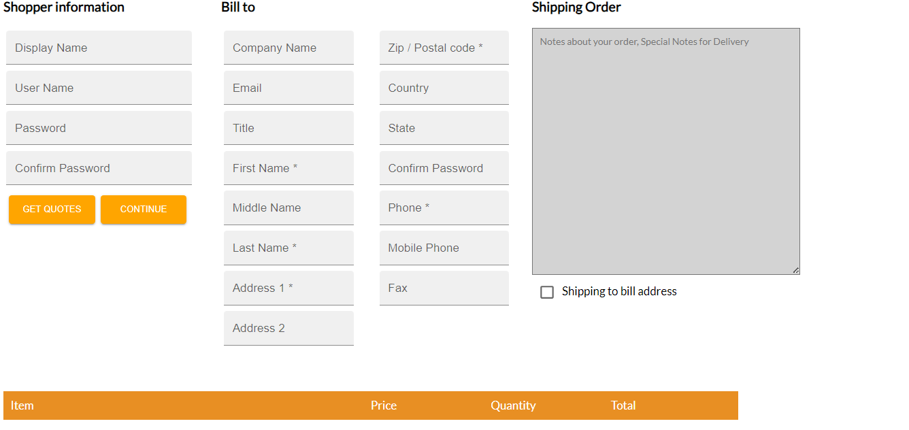
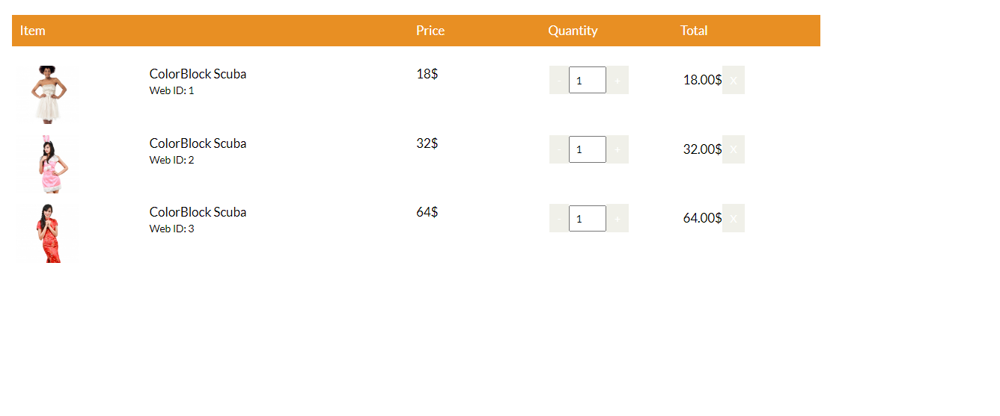

**This repository is my first project made using the react library. The time period needed to make the final product was 3 months. In this period of time working on this repository I learned to use API, REDUX, MUI, Styled-Components, react-responsive-carousel and other packages. Learned how to make a mobile-friendly site, how to make a working shop page.**

Here are some photos of website:

\***\*https://nitshop.pages.dev/****

### `npm install`

### `npm start`
